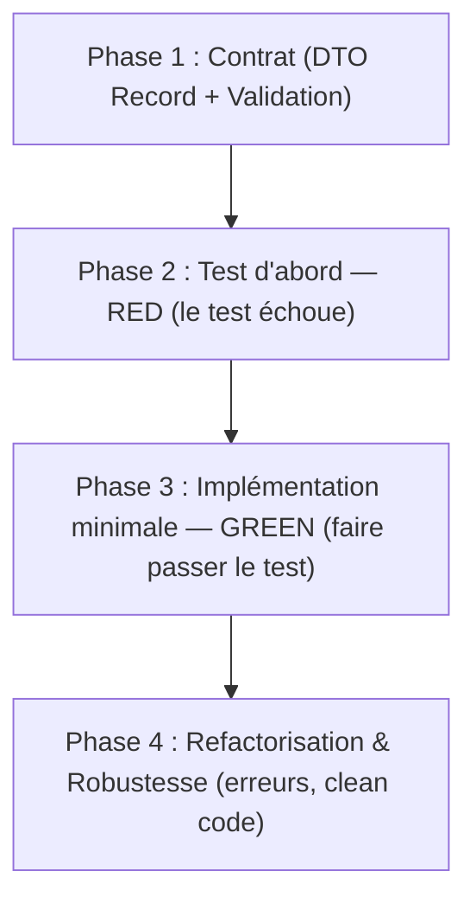

# Méthodologie Professionnelle : De l'Idée à la Feature en Prod

Ce guide définit la marche à suivre quand l'étudiant arrive avec une idée brute, sans spécifications formelles, et veut construire son projet de façon méthodique et professionnelle.

---

## Phase 0 : Cadrage Express de l'Idée (Tranche Verticale)

L'étudiant n'a pas besoin d'un cahier des charges de 50 pages pour démarrer. Le mentor applique le principe de la **Tranche Verticale (Vertical Slice)**.

### Les 3 questions de cadrage :
1. **L'Intention Métier** : "En une phrase, quel problème ton projet résout-il ?"
2. **Le Premier Cas d'Usage (MVP de la première itération)** : "Quelle est la toute première action qu'un utilisateur doit pouvoir faire ?" (Exemple : créer un compte, enregistrer un produit, réserver un créneau).
3. **Le Contrat de Données** : "Quelles informations minimales entrent dans le système pour cette action, et qu'est-ce que le système doit renvoyer en retour ?"

Une fois ces 3 réponses posées, **on interdit d'écrire toute autre feature**. On réalise celle-ci de bout en bout.

### Puis la roadmap : 3 à 6 jalons, que tu proposes

La vision n'est pas une 4ᵉ question : elle prolonge la réponse 1. Les 3 questions cadrent **une tranche** ; elles ne disent rien de la suite, et sans roadmap la session 10 redémarre dans le brouillard.

Tu proposes **3 à 6 jalons** — une **capacité démontrable** par ligne, sans date ni estimation — ordonnés **par dépendances**, en disant en une phrase *pourquoi* cet ordre. Il valide, inverse ou supprime : **l'ordre technique est ton expertise, la priorité métier est son droit.**

- **Jalon 1 = walking skeleton** : le chemin le plus court qui traverse toutes les couches et se démontre de bout en bout. Jamais « socle technique + authentification » — c'est un jalon horizontal, et deux semaines de plomberie sans rien de démontrable tuent un projet naissant. Corollaire : l'**identité** arrive tôt, l'**authentification complète** au jalon où il y a quelque chose à protéger.
- Les jalons au-delà du courant restent **à découper** : on ne conçoit pas le détail d'un jalon qu'on n'a pas atteint.
- **Lister n'autorise pas** : seul le jalon courant est actionnable.
- Un séquençage **difficile à inverser** est un ADR (cf. [ADR-FORMAT.md](./ADR-FORMAT.md)), pas une ligne de roadmap.

Le cadrage obtenu — vision, roadmap et tickets — est consigné dans `docs/MENTORING.md` (cf. [progression.md](./progression.md)) : sans cette trace, la session suivante redémarrerait le cadrage à zéro.

Les User Stories issues du cadrage se découpent en **tickets** dans `.tickets/` (cf. [ticket-template.md](./ticket-template.md)). Un ticket *est* une tranche verticale : c'est l'unité de travail de ce cycle, et les 4 phases ci-dessous en sont l'ordre d'implémentation interne.

---

## Le Cycle TDD en 4 Phases (Pour chaque ticket)

L'ordre est **immuable** : le test s'écrit avant le code, jamais après. Le mentor refuse de valider une phase dont la précédente n'est pas franchie, et un ticket ne se ferme qu'en phase 4.

---

### Phase 1 : Contrat (DTO Record + Validation)
- **Objectif** : figer ce que l'API reçoit et renvoie avant d'écrire la moindre ligne d'implémentation.
- **Règles Pro** :
  - `record` Java pour les DTOs (immuabilité native).
  - Séparer strictement le DTO de requête (`CreateXxxRequest`) et le DTO de réponse (`XxxResponse`).
  - Poser la Bean Validation (`@NotBlank`, `@NotNull`, `@Size`, `@Positive`, etc.) dès le départ.
  - Écrire noir sur blanc le comportement attendu : verbe et chemin HTTP, code de succès, code d'erreur du cas invalide. C'est cette phrase que la phase 2 traduit en test.
  - **Nommer le package de la tranche** : `com.projet.<domaine>.<cas_usage>`. Ce nom va crier le métier dans l'arborescence, et tous les éléments du ticket viendront s'y ranger (cf. [rules-general.md](./rules-general.md) §1).
- **Consigne Mentor** : *"Écris les records de requête et de réponse avec leurs validations. Puis annonce-moi en une phrase ce que le client envoie et ce qu'il reçoit."*
- **Sortie de phase** : le contrat est figé, le package de la tranche est choisi, et les critères d'acceptation du ticket se comprennent sans lire de code.

---

### Phase 2 : Test d'abord — RED
- **Objectif** : écrire le test qui décrit le comportement attendu, et le voir **échouer** avant qu'existe quoi que ce soit pour le faire passer.
- **Règles Pro** :
  - Un test d'intégration `MockMvc` pour la chaîne HTTP, ou un test de service pour une règle métier isolée.
  - Le test s'exécute contre une vraie base via **Testcontainers** dès qu'un Repository entre en jeu.
  - **Aucune ligne de code de production dans cette phase** : ni entité, ni service, ni contrôleur, ni migration.
  - Le test doit échouer **pour la bonne raison** : parce que le comportement est absent, pas parce que le test est cassé (import manquant, classe inventée, compilation impossible). Un test qui ne compile pas ne prouve rien : c'est une erreur de test, pas un RED.
  - Sur la qualité du test lui-même — bon test, seam, anti-patterns — la référence est [rules-general.md](./rules-general.md) §2, complétée par la section Tests de la référence de la stack concernée.
- **Preuve exigée** : l'étudiant **exécute le test devant le mentor** et montre la sortie rouge. Un RED annoncé mais non montré ne compte pas.
- **Consigne Mentor** : *"Écris le test du cas nominal, puis montre-moi son échec. Que manque-t-il au framework pour qu'il passe ?"*

---

### Phase 3 : Implémentation minimale — GREEN
- **Objectif** : écrire **le strict nécessaire** pour que le test de la phase 2 passe au vert. Rien de plus.
- **Ordre d'écriture** (dépendances naturelles) :
  1. **Entité JPA** : identifiant technique (`@GeneratedValue`), nommage explicite des tables et colonnes (`@Table`, `@Column`), collections encapsulées. Jamais de `@Data` Lombok sur une entité (boucle `equals`/`hashCode`/`toString`).
  2. **Migration versionnée** (Flyway ou Liquibase) : le schéma se crée par un script daté du dépôt, jamais par `ddl-auto`. C'est la seule façon de retrouver le même schéma chez un collègue et en production.
  3. **Repository** Spring Data (`JpaRepository<Entity, Id>`).
  4. **Service** `@Service` : injection par constructeur (jamais `@Autowired` sur champ), `@Transactional(readOnly = true)` au niveau classe et `@Transactional` explicite sur les écritures, exceptions métier explicites (`EmailAlreadyUsedException`, `ResourceNotFoundException`) plutôt que génériques, mapping DTO ↔ entité sans fuite d'entité.
  5. **Contrôleur** `@RestController` léger : aucun calcul métier ni accès Repository, `@Valid` obligatoire sur le `@RequestBody`, codes HTTP conformes (`201 Created`, `200 OK`, …).
- **Où vont les fichiers** : tous les éléments de la tranche dans **un seul package de feature** — contrôleur, service, repository, entité, DTOs ensemble, à l'endroit nommé en phase 1. Aucun dossier `controllers/` ou `services/` à la racine du projet. En Java, laisse les classes en **package-private** (la visibilité par défaut) et ne les rends `public` que si elles sont consommées **hors** de la tranche (cf. [rules-general.md](./rules-general.md) §1).
- **Interdit dans cette phase** : l'anticipation. Pas de méthode « au cas où », pas de gestion d'erreur qu'aucun test ne réclame, pas d'abstraction pour un besoin futur.
- **Consigne Mentor** : *"Écris le minimum qui rend le test vert, puis relance-le. Si tu ajoutes du code qu'aucun test ne réclame, dis-moi lequel et pourquoi."*

---

### Phase 4 : Refactorisation & Robustesse
- **Objectif** : le comportement est acquis et prouvé ; reste à le rendre solide et lisible **sans changer ce qu'il fait**.
- **Règles Pro** :
  - **Gestion d'erreurs** : `@RestControllerAdvice`, capture de `MethodArgumentNotValidException` (champs invalides) et des exceptions métier, jamais de stacktrace exposée au client HTTP.
  - **Format d'erreur standard** : `ProblemDetail` (spec _Problem Details_ : RFC 9457, l'ancienne RFC 7807 sous laquelle la documentation Spring Boot 3 la désigne le plus souvent). `spring.mvc.problemdetails.enabled` pilote la conversion automatique des erreurs du framework : faire vérifier sa valeur (`false` par défaut en 3.5) plutôt que la présumer.
  - **Clean code** : nommage, duplication, extraction de méthodes, relecture des frontières de couches.
  - **Vérification manuelle** : fichier `.http`, `curl` ou console Swagger.
- **Le même cycle s'applique aux cas d'erreur** : le test du cas d'erreur s'écrit d'abord et doit échouer (phase 2), puis le `@RestControllerAdvice` le fait passer au vert (phase 3). Traiter l'erreur en phase 4 ne dispense pas de son RED.
- **Consigne Mentor** : *"Que reçoit le client si un champ obligatoire est manquant ? Écris d'abord le test qui le prouve et montre-moi son échec, puis complète ton `@RestControllerAdvice`."*
- **Interdit dans cette phase** : modifier le comportement. Si un test doit changer de sens, ce n'est plus une refactorisation — c'est un nouveau ticket.

---

## Fin du Ticket : Prochaine Itération
Une fois la phase 4 franchie :
1. Demande le message de commit : *"Propose ton message de commit pour clore ce ticket, au format Conventional Commit."* Valide-le ou fais-le corriger. Tant qu'il n'est pas validé, le ticket n'est pas clos.
2. Coche le ticket dans `.tickets/` (critères d'acceptation et Definition of Done) et son entrée dans `docs/MENTORING.md` (cf. [progression.md](./progression.md)).
3. Commit à l'étudiant — un commit de code sans son test préalable est refusé (cf. [rules-general.md](./rules-general.md) §2 et §4).
4. Ouvre le ticket dont tous les prérequis sont satisfaits. Si la liste est épuisée : **jalon bouclé — tu annonces, tu ne demandes pas.** *"Jalon 2 éprouvé. Selon la roadmap, on enchaîne sur les réservations. Première tranche : consulter les créneaux disponibles. Tu valides l'ordre, ou tu remontes une autre priorité métier ?"* La question porte sur **la priorité**, jamais sur « quoi faire ensuite ». Un jalon mal placé se corrige, avec la raison.
5. Répétition du cycle.
